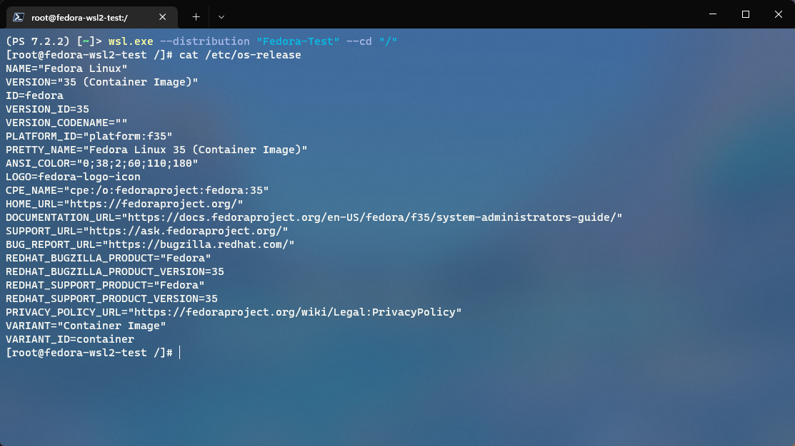

# Fedora WSL Image Creator



This is a simple Windows Subsystem for Linux (WSL) image creator for Fedora. It works similar to my other repo for RockyLinux ([@Smalls1652/wsl2-rockylinux](https://github.com/Smalls1652/wsl2-rockylinux))

In addition, **no files** of the distro will be distributed through this repo. This is only meant to help create an image of Fedora locally.

For more info on how to import a custom Linux distribution for WSL, [check out this document from Microsoft](https://docs.microsoft.com/en-us/windows/wsl/use-custom-distro).

## 🧰 Prerequisites

- **A Linux-based Operating System**
  - This can be from a physical system, a virtual machine, or another WSL instance on your computer.
- **Packages installed on the system:**
  - A container platform.
    - Docker
      - `docker`
        - [Install instructions](https://docs.docker.com/engine/install/#server)
    - Podman
      - `podman`
        - [Install instructions](https://podman.io/getting-started/installation#linux-distributions)
    - ⚠️ **Note:** This has been tested with both `docker` and `podman`; however, **I personally use `podman`**, so there may be some unintentional breakage with `docker`.

## 🔨 Build the image

> ⚠️ **Note:**
>  
> If you're intending to run this on an existing WSL instance, I would suggest cloning the repo to Windows and running the script from that location inside of the WSL instance. It will remove the step of copying the output file. For example, it would be located somewhere in `/mnt/c/` in the WSL instance (Relative to where you cloned the repo to).

On your Linux host:

1. Navigate to the cloned repo folder on your local machine in a terminal.
2. Run `./createFedoraImage.sh`
    - If needed, you may need to run `chmod +x ./createFedoraImage.sh` to allow it to execute.
3. Once the script finishes, it outputs the file to `./out/fedora-latest.tar` in the cloned repo directory.

Make sure you copy the `fedora-latest.tar` file to your Windows host.

## ▶️ Using the image

On your Windows host:

1. Launch a command prompt or PowerShell console.
2. Run the following command: `wsl.exe --import "Fedora" "C:\path\to\dir\" "C:\path\to\fedora-latest.tar"`
    - The first argument is the name you want to call the distribution.
    - The second argument is the path to store the WSL VM's `.vhdx` file.
    - The third argument is the path where the `.tar` file is located.
3. You can now launch a terminal to the distribution by running `wsl.exe --distribution "Fedora"`.

### 💻 Windows Terminal profile

After importing the distribution, you can add this to your Windows Terminal settings JSON file to make it easier to access (If it doesn't add it automatically).

In the `list` array under the `profiles` object, add this to the list:

```json
{
    "guid": "{8e4cc343-81f4-4d0e-a184-249b9dc83bbd}",
    "hidden": false,
    "name": "Fedora",
    "source": "Windows.Terminal.Wsl"
}
```

### 🤔 Things to do after importing

- I would set up a user account for the image. [Check out this section in the WSL documentation](https://docs.microsoft.com/en-us/windows/wsl/use-custom-distro#add-wsl-specific-components-like-a-default-user) for details on how to configure it.
